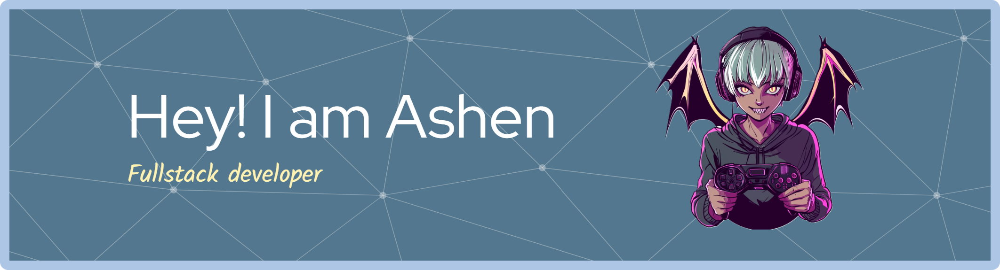

<!-- Header image: if you uploaded the image to your repo use a relative path like ./github-banner.png -->

# 👋 Hi, I'm **Ashen Dissanayake**
### 🎓 BSc in Computer Science (Reading) — University of Jaffna  
### 🚀 Full-Stack Developer | MERN Stack | UI/UX Enthusiast  

---

<!-- Typing animation -->

---

## 🔥 About Me
- 💻 MERN Stack Developer (MongoDB • Express • React • Node)  
- ⚡ Passionate about modern web apps & UI/UX  
- 📚 Constantly learning — always building  
- 📩 Email: **ashendissanayake999@gmail.com**

---

## 🌐 Connect With Me

---

## 🛠 Tech Stack

  

---

## 📊 GitHub Stats

  

---

## 🔥 GitHub Streak

  

---

## 🏆 Achievements

  

<!--
**ashen-dsn25/ashen-dsn25** is a ✨ _special_ ✨ repository because its `README.md` (this file) appears on your GitHub profile.

Here are some ideas to get you started:

- 🔭 I’m currently working on ...
- 🌱 I’m currently learning ...
- 👯 I’m looking to collaborate on ...
- 🤔 I’m looking for help with ...
- 💬 Ask me about ...
- 📫 How to reach me: ...
- 😄 Pronouns: ...
- ⚡ Fun fact: ...
-->
